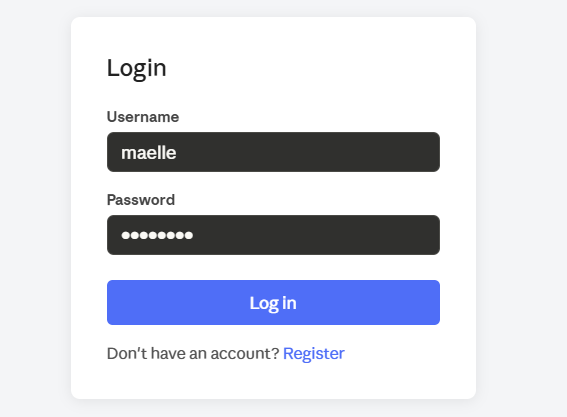
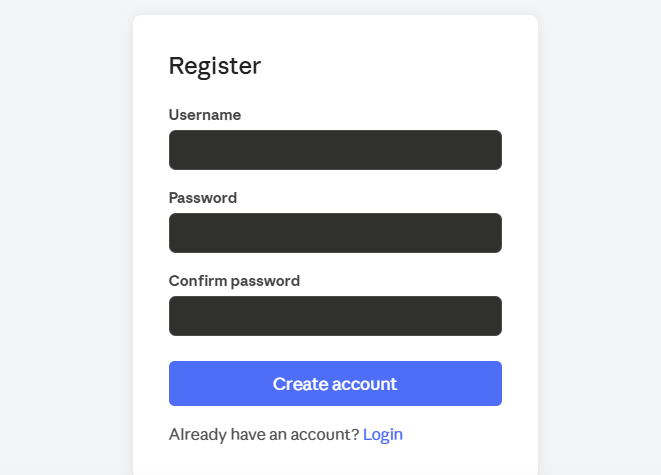

# Secure Login System

A small authentication app built with Flask.  
The goal was to go beyond a basic tutorial and handle proper password hashing, CSRF protection and secure session configuration.

## Screenshots

| Login | Register |
|---|---|
|  |  |

## Features
- User registration and login
- Passwords hashed with **bcrypt** (salted, never stored in plaintext)
- **CSRF tokens** on every form (via Flask-WTF)
- Session cookies set to `HttpOnly` and `SameSite=Lax`
- Vague login error messages to avoid leaking whether a username exists
- SQLite database (zero config, easy to swap for Postgres later)

## Stack

| Layer | Choice |
|---|---|
| Backend | Python / Flask |
| Auth | bcrypt |
| CSRF | Flask-WTF |
| DB | SQLite (via built-in `sqlite3`) |

## Getting started

```bash
# 1. Clone and move in
git clone https://github.com/maellemd/secure_login.git
cd secure_login

# 2. Create a virtual environment
python -m venv venv
source venv/bin/activate      # Windows: venv\Scripts\activate

# 3. Install dependencies
pip install -r requirements.txt

# 4. Set a secret key (or just run as-is for local testing)
export SECRET_KEY="pick-something-random"

# 5. Run
python app.py
```

Open `http://127.0.0.1:5000` in your browser.

## Project structure

```
secure_login/
├── app.py                  # all routes and logic
├── requirements.txt
├── static/
│   └── css/style.css
└── templates/
    ├── base.html
    ├── login.html
    ├── register.html
    └── dashboard.html
```

## What I learned / Notes to self

- `bcrypt.gensalt()` generates a unique salt per password automatically — no need to manage salts yourself.
- The CSRF token is injected by Flask-WTF and validated before the route handler runs. If it's missing or wrong, the request is rejected with a 400.
- Returning the same error message for wrong username and wrong password isn't laziness — it's intentional. If you say "user not found" vs "wrong password", an attacker can enumerate valid usernames.
- `session.clear()` before setting new session data on login prevents session fixation attacks.

## Possible next steps

- Add rate limiting on `/login` (e.g. with `Flask-Limiter`)
- Email verification on registration
- Password reset flow
- Swap SQLite for PostgreSQL for anything beyond local dev